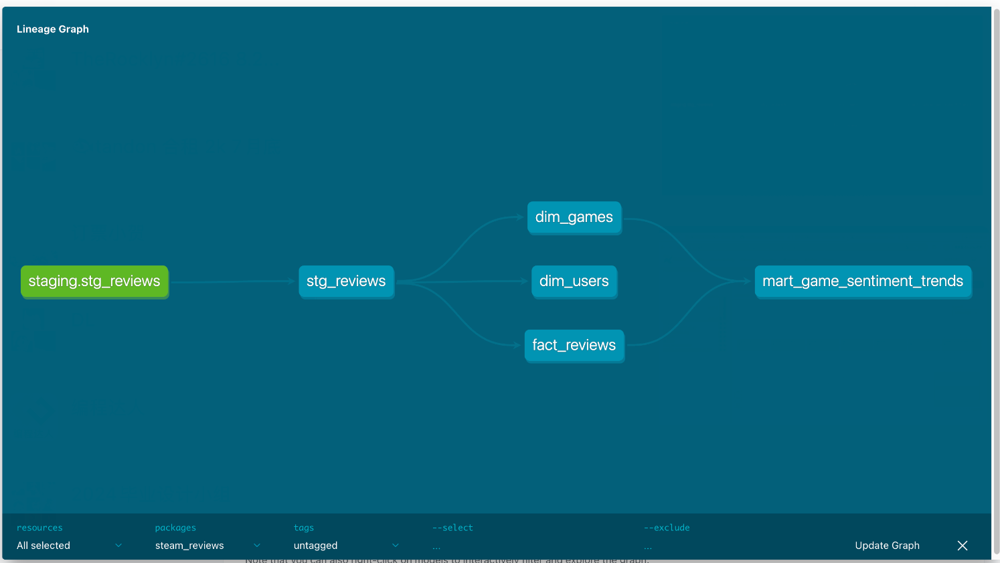
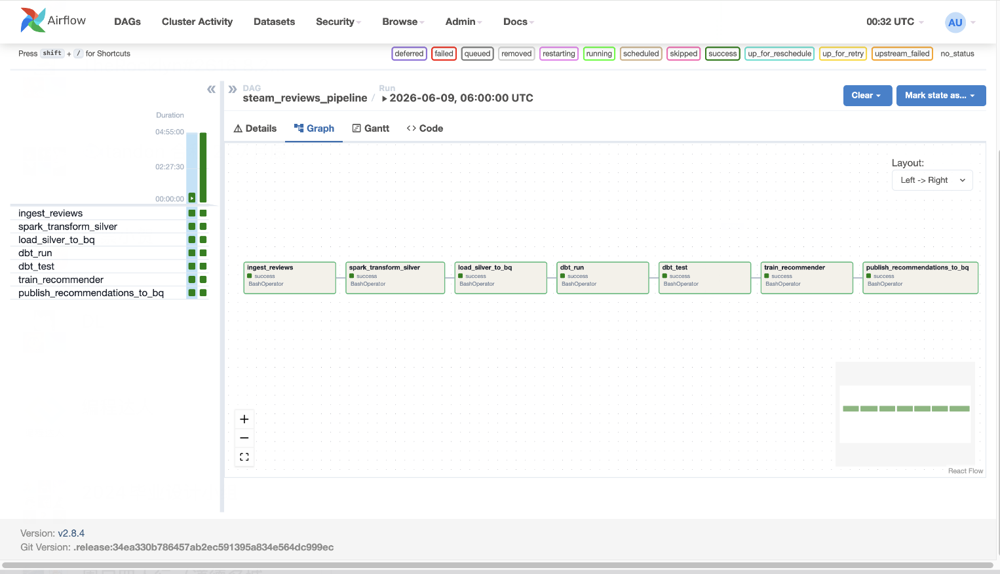
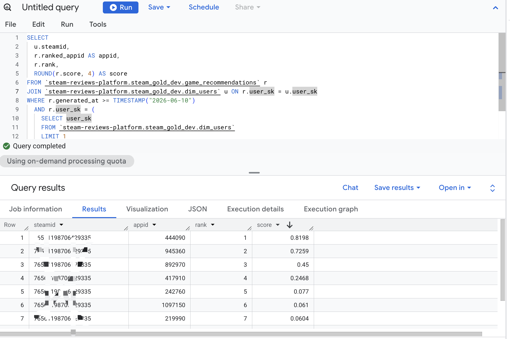

# Steam Reviews Data Platform

Batch data pipeline on GCP that ingests Steam game reviews, processes them through a
bronze → silver → gold medallion architecture, and produces personalized game
recommendations via collaborative filtering. Infrastructure is managed with Terraform;
orchestration runs on Airflow.

---

## Architecture

```
                      ┌────────────────────────────────────┐
                      │    Airflow DAG (daily, 06:00 UTC)   │
                      └──────────────┬─────────────────────┘
                                     │ schedules each step
┌──────────┐  raw JSON  ┌────────────▼────────────┐
│  Steam   │──────────▶│  GCS — bronze             │
│  Web API │            │  dt=YYYY-MM-DD/appid=NNN  │
└──────────┘            └────────────┬─────────────┘
                                     │ Dataproc Serverless
                                     ▼
                         ┌─────────────────────────┐
                         │  GCS — silver            │
                         │  Parquet, partitioned    │
                         └──────────┬──────────────┘
                                    │ bq load
                                    ▼
                         ┌─────────────────────────┐
                         │  BigQuery — staging      │
                         │  stg_reviews (DAY/dt)    │
                         └──────────┬──────────────┘
                                    │ dbt run / dbt test
                                    ▼
                         ┌─────────────────────────┐
                         │  BigQuery — gold         │
                         │  dim_games               │
                         │  dim_users               │
                         │  fact_reviews ①②        │
                         └────────┬────────────────┘
                                  │ Dataproc Serverless
                                  ▼
                         ┌─────────────────────────┐
                         │  Spark MLlib ALS         │
                         │  (implicit feedback)     │
                         └────────┬────────────────┘
                                  │ bq load
                                  ▼
                         game_recommendations
                         (clustered by user_sk)
                                  │
                                  ▼
                         FastAPI / Cloud Run (gated)
```

① `fact_reviews` partitioned by `dt` (DATE), clustered by `game_sk`  
② Incremental dbt strategy: `insert_overwrite` per `dt` partition — re-running a date is idempotent

---

## Tech Stack

| Layer | Technology |
|-------|-----------|
| Ingestion | Python 3.11, Steam Web API, GCS |
| Transform | PySpark 3.5, Dataproc Serverless, VADER sentiment |
| Storage | GCS (bronze/silver), BigQuery |
| Modeling | dbt-bigquery, BigQuery star schema |
| Recommender | Spark MLlib ALS (implicit feedback) |
| Orchestration | Apache Airflow 2.8.4, Docker Compose (local) / Cloud Composer (GCP) |
| Infrastructure | Terraform 1.5+, GCP (GCS, BigQuery, Dataproc, IAM, Artifact Registry) |
| CI/CD | GitHub Actions (lint + tests on PR; build + deploy on merge) |
| API demo | FastAPI, Cloud Run (gated off by default) |

---

## Repository Layout

```
.
├── ingestion/               # Steam API ingester
│   ├── ingester.py          #   cursor-paginated, checkpoint-resumable, rate-limited
│   ├── checkpoint.py        #   cursor state persisted to GCS or local disk
│   ├── rate_limiter.py      #   token bucket + jitter
│   ├── appids.py            #   SteamSpy top-N fetch or static list
│   └── tests/
├── spark/                   # PySpark jobs (run on Dataproc Serverless)
│   ├── transform_silver.py  #   dedup, junk filter, derived features
│   ├── sentiment.py         #   VADER sentiment UDF (score + label)
│   ├── build_matrix.py      #   user-item implicit rating matrix
│   ├── recommender.py       #   ALS training, evaluation, top-N output
│   └── tests/
├── dbt/                     # BigQuery gold star schema
│   ├── models/
│   │   ├── staging/         #   stg_reviews (light cleanup)
│   │   └── marts/           #   dim_games, dim_users, fact_reviews,
│   │                        #   mart_game_sentiment_trends
│   └── profiles.yml.example
├── airflow/
│   └── dags/steam_reviews_pipeline.py  # full 7-task DAG
├── api/                     # FastAPI demo (Cloud Run, gated off)
│   ├── main.py
│   └── Dockerfile
├── terraform/               # all GCP resources
│   ├── modules/
│   │   ├── storage/         #   GCS bronze + silver buckets, lifecycle rules
│   │   ├── bigquery/        #   datasets, stg_reviews + game_recommendations tables
│   │   ├── iam/             #   per-stage service accounts (least privilege)
│   │   ├── wif/             #   Workload Identity Federation + Artifact Registry
│   │   ├── dataproc/        #   staging bucket + IAM (gated)
│   │   ├── composer/        #   Cloud Composer (gated, ~$300+/month)
│   │   └── cloudrun/        #   Cloud Run API (gated, scales to zero)
│   ├── main.tf
│   ├── variables.tf
│   ├── backend.tf           #   GCS remote state
│   └── terraform.tfvars.example
├── docker/
│   └── docker-compose-airflow.yml  # local Airflow (LocalExecutor + PostgreSQL)
├── scripts/
│   ├── dataproc_submit.sh   #   submit transform_silver to Dataproc Serverless
│   ├── bq_load_silver.sh    #   bq load silver Parquet → stg_reviews
│   └── dataproc_als_train.sh#   submit recommender to Dataproc Serverless
├── docs/
│   └── teardown.md          # cost guide + teardown instructions
├── .github/workflows/
│   ├── ci.yml               # PR: lint, unit tests, terraform validate, dbt parse
│   └── deploy.yml           # merge: build ingester image, terraform plan, deploy DAG
└── pyproject.toml
```

---

## Running the Pipeline

### Prerequisites

- Python 3.11+, Java 17+ (for PySpark)
- [Terraform 1.5+](https://developer.hashicorp.com/terraform/install)
- [Google Cloud SDK](https://cloud.google.com/sdk/docs/install)
- Docker + Docker Compose (local Airflow only)

### Install

```bash
git clone https://github.com/xcy103/game-recommendation-system.git
cd game-recommendation-system
python -m venv .venv && source .venv/bin/activate
pip install -e ".[dev]"
```

### Tests (no GCP needed)

```bash
# Ingestion unit tests — mocked HTTP, no real API calls
pytest ingestion/tests -m "not integration"

# PySpark unit tests — local[1] SparkSession, in-memory data
pytest spark/tests -m "not integration"
```

### 1. Ingestion — Steam API → GCS bronze

```bash
# Ingest reviews for specific appids into local bronze path
python -m ingestion.ingester \
  --appids 730 570 440 \
  --dt 2024-01-01 \
  --out ./data/bronze \
  --rps 1.0 \
  --max-pages 50

# Or fetch the top-100 games list from SteamSpy, then ingest
python -m ingestion.appids --top 100 > appids.txt
python -m ingestion.ingester --appids-file appids.txt --dt 2024-01-01 --out ./data/bronze
```

Ingestion is cursor-paginated and checkpoint-resumable: interrupted runs pick up from
the last saved cursor. Rate limit is configurable (`--rps`, default 1.0 req/s).

On GCP, the Airflow task runs this as a BashOperator pointing at GCS as the output
location (`--project`, `--environment`).

### 2. Spark transform — bronze → silver (Dataproc Serverless)

```bash
# Submit to Dataproc Serverless (requires terraform apply with enable_dataproc=true)
DT=2024-01-01 bash scripts/dataproc_submit.sh

# Smoke test: 5-page limit (~$0.005)
DT=2024-01-01 MAX_PAGES=5 bash scripts/dataproc_submit.sh
```

Transform steps applied per record:

1. Flatten nested JSON, cast types
2. Deduplicate by `(recommendationid, timestamp_updated)` — keep latest version
3. Filter: remove empty reviews and non-English (`language != 'english'`)
4. Derived features: `review_length`, `playtime_hours`, `playtime_bucket`, `helpfulness_ratio`
5. VADER sentiment: `sentiment_score` (float, −1 to 1), `sentiment_label` (pos/neu/neg)
6. Implicit rating: `voted_up_weight × log1p(playtime_hours)`, normalised to [0, 1]
7. Write Parquet to `gs://{project}-silver-{env}/reviews/dt=DT/`

### 3. Load silver → BigQuery staging

```bash
DT=2024-01-01 bash scripts/bq_load_silver.sh
```

Loads `gs://{project}-silver-{env}/reviews/dt=DT/*.parquet` into
`steam_staging_{env}.stg_reviews` via `bq load --source_format=PARQUET`.
The table is pre-created by Terraform with `time_partitioning.field = "dt"` (DAY).

### 4. dbt — staging → gold star schema

```bash
cd dbt

# Copy and fill in profiles (method: oauth uses gcloud ADC)
cp profiles.yml.example profiles.yml

# Build all models
dbt run --profiles-dir . --target dev --no-version-check

# Data quality tests: not_null, unique, relationships, custom positive_rate
dbt test --profiles-dir . --target dev --no-version-check
```

Models:

| Model | Materialization | Notes |
|-------|-----------------|-------|
| `stg_reviews` | view | light cleanup over staging source |
| `dim_games` | table | one row per appid, FARM_FINGERPRINT surrogate key |
| `dim_users` | table | one row per steamid |
| `fact_reviews` | incremental | partitioned `dt`, clustered `game_sk`; `insert_overwrite` |
| `mart_game_sentiment_trends` | table | daily sentiment aggregates per game |

### 5. ALS recommender — training and output

```bash
# Submit ALS training job to Dataproc Serverless
DT=2024-01-01 TOP_N=10 bash scripts/dataproc_als_train.sh

# Load recommendations Parquet into BigQuery gold
bq load \
  --source_format=PARQUET \
  --replace=true \
  "steam-reviews-platform:steam_gold_dev.game_recommendations" \
  "gs://steam-reviews-platform-dataproc-staging-dev/recommendations/2024-01-01/*.parquet"
```

ALS hyperparameters (`spark/recommender.py`):

| Parameter | Value |
|-----------|-------|
| `rank` | 50 |
| `maxIter` | 10 |
| `regParam` | 0.01 |
| `alpha` | 40.0 |
| `implicitPrefs` | `True` |
| `seed` | 42 |

After training, a seen-item anti-join removes all previously-played games from each
user's candidate list before ranking, so `game_recommendations` contains only unseen
suggestions.

### 6. Local Airflow (Docker Compose)

```bash
# First time: write your uid to .env
echo "AIRFLOW_UID=$(id -u)" > .env

# Initialise DB and create admin user
docker compose -f docker/docker-compose-airflow.yml up airflow-init

# Start webserver and scheduler
docker compose -f docker/docker-compose-airflow.yml up -d airflow-webserver airflow-scheduler

# Open UI: http://localhost:8080  (admin / admin)
```

`LOCAL_MODE=true` is set in the compose file — each BashOperator prints what it
would execute instead of making real GCP calls. Set `LOCAL_MODE=false` (or remove it)
to run against a real project.

The DAG `steam_reviews_pipeline` runs at 06:00 UTC daily. Task chain:

```
ingest_reviews → spark_transform_silver → load_silver_to_bq
  → dbt_run → dbt_test → train_recommender → publish_recommendations_to_bq
```

---

## Infrastructure (Terraform)

```bash
cd terraform
cp terraform.tfvars.example terraform.tfvars  # set project_id, billing_account_id

terraform init
terraform plan   # review before applying
terraform apply
```

Feature gates (all default `false`):

| Variable | Default | Controls |
|----------|---------|---------|
| `enable_dataproc` | `false` | Dataproc staging bucket + IAM bindings |
| `enable_composer` | `false` | Cloud Composer environment (~$300+/month) |
| `enable_cloudrun` | `false` | Cloud Run API service (scales to zero) |
| `enable_wif` | `false` | Workload Identity Federation + Artifact Registry repo |

GCP resources (after `terraform apply`):

| Resource | Name |
|----------|------|
| Bronze bucket | `steam-reviews-platform-bronze-dev` |
| Silver bucket | `steam-reviews-platform-silver-dev` |
| BQ staging dataset | `steam_staging_dev` |
| BQ gold dataset | `steam_gold_dev` |
| Terraform state | `gs://steam-reviews-platform-tfstate/terraform/state` |

---

## CI/CD

**On PR (`ci.yml`):** ruff + black lint, ingestion unit tests, PySpark unit tests
(Java 17, `local[1]`), `terraform validate + fmt -check`, `dbt parse`.

**On merge to main (`deploy.yml`):** authenticates via Workload Identity Federation
(no SA key file), builds and pushes `ingester:{sha}` + `ingester:latest` to Artifact
Registry, runs `terraform plan`, and uploads the DAG to Composer's GCS bucket when the
repo variable `ENABLE_COMPOSER=true` is set.

Prerequisites for the deploy workflow:

```
GCP_WORKLOAD_IDENTITY_PROVIDER  ← terraform output -raw workload_identity_provider
GCP_SERVICE_ACCOUNT             ← terraform output -raw github_ci_sa_email
```

---

## Results

Full pipeline run on the collected dataset:

| Metric | Value |
|--------|-------|
| Reviews ingested | 290,000 |
| Unique users | 219,654 |
| Unique games | 101 |
| Training interactions (80% split) | ~232,000 |
| Recommendations generated | 2,196,540 |
| Top-N per user | 10 |
| Seen-item filter | applied (train ∪ test anti-join) |

Offline evaluation on 20% held-out interactions (random split, seed=42):

| Metric | Value |
|--------|-------|
| Precision@10 | 0.0264 |
| NDCG@10 | 0.0977 |

Low absolute values are expected at this catalogue size: with 101 items total, the
recommendation space is small and the held-out set per user is typically 1–2 items.

---

## Screenshots

*dbt lineage graph (stg_reviews → dims → fact_reviews → mart):*  


*Airflow DAG graph view:*  


*BigQuery — sample top-10 recommendations for a user:*  


---

## Cost & Teardown

See [docs/teardown.md](docs/teardown.md) for a full cost breakdown by resource,
step-by-step teardown, and emergency stop procedure.

Normal dev spend with Composer off: well under $1/day. Set a GCP budget alert via
`billing_account_id` in `terraform.tfvars`.
